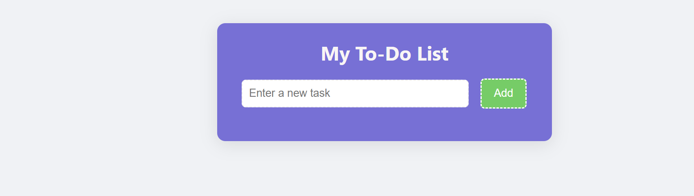
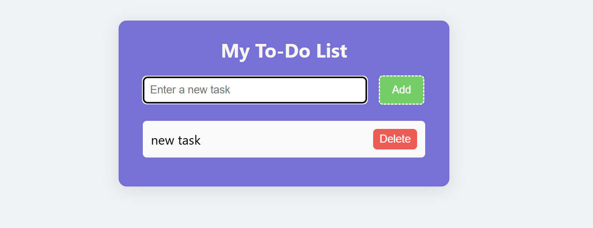
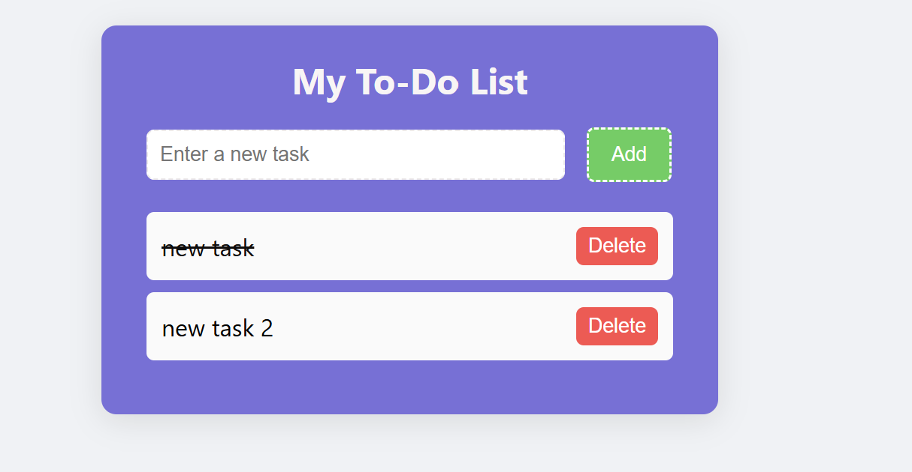
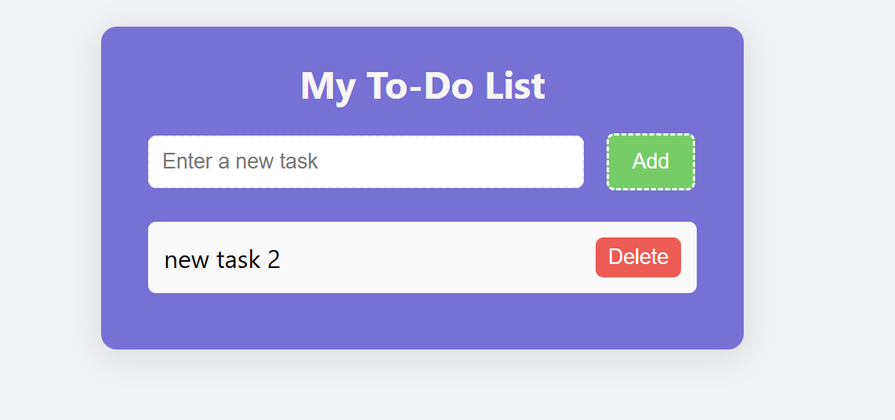

# 📝 Simple To-Do List App

This is a simple, lightweight **To-Do List web application** built using **HTML, CSS, and JavaScript**. It allows you to add tasks, mark them as completed, and delete them. Tasks and their statuses are **saved in your browser's local storage**, so they persist even after you refresh or close the page!

---

## 🚀 Features

- ✅ Add new tasks
- ✅ Mark tasks as completed
- ✅ Delete tasks
- ✅ Save tasks in the browsers local storage
- ✅ Simple user interface

---

## 💡 Techniques & Concepts Used

- **HTML**: To structure the page and elements (input, button, list).
- **CSS**: For styling the panel, buttons, and task items to make it user-friendly and appealing.
- **JavaScript**:
  - DOM manipulation (creating and modifying elements dynamically).
  - Event handling (click events for add, toggle complete, delete).
  - Local storage API for saving tasks persistently.
  - JSON serialization (`JSON.stringify`, `JSON.parse`) to store structured data in to the local storage.

---

## 💻 How to Use

1️⃣ Clone or download this repository.  
2️⃣ Open `index.html` in your browser.  
3️⃣ You will see an input box and an "Add" button:

- Type a task name in the input box.
- Click "Add" or "Enter" key to add it to your list.
  4️⃣ Click on a task to mark it as completed (it will be crossed out).
  5️⃣ Click "Delete" to remove a task.

---

## 🖼️ Example Screenshots

- After opening the app:
  

- After creating first task:
  

- After completing a task:
  

- After deleting the first task:
  
