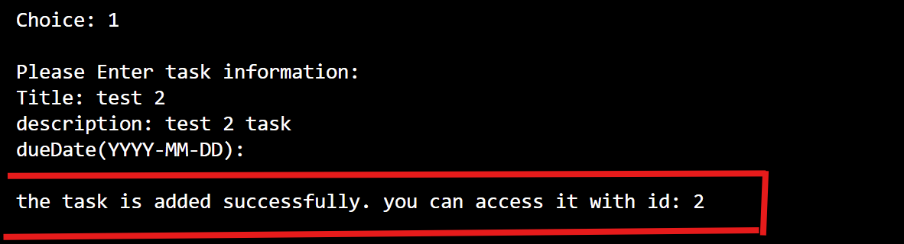
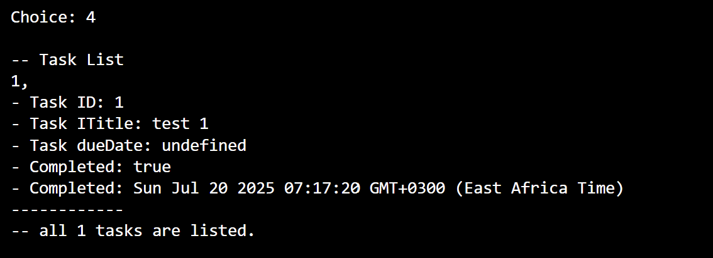

# 📝 Command-Line To-Do App

A simple interactive command-line To-Do list application written in **TypeScript**. It allows users to:

- Create tasks
- Remove tasks
- Mark tasks as complete
- View all tasks
- View only completed tasks

## 📦 Features

- **Task Creation**: Add tasks with title, optional description, and optional due date.
- **Validation**: Prevent past due dates or empty titles.
- **Completion Tracking**: Mark tasks complete and log completion time.
- **View Options**: List all tasks or just completed ones.
- **Persistent Session**: Uses an in-memory `Map` to store task data during session runtime.

## 🛠 Requirements

- Node.js (>= 18)
- TypeScript (installed globally or via devDependencies)

## 🚀 Setup Instructions

1. **Clone the repository or copy the code and files**

2. **Go in to the directory you stored the code run "tsc todo.ts" inside "src" dir. this will compile the ts to js.**

3. **after that go to "dist" directory and run "node todo.js" to run the program on your terminal.**

4 **To use the program read the options on the screen and follow the options.**

## Operation Instructions
1. **After starting the app i will give choice to do as a main page**
    example usage:
        

2. **The app uses Task ID to identify tasks to delete and update. that id is given when the task is first created or when listing tasks**
    example usage:
      

3. **When creating a task we shod give all information required on the screen**
    example usage:
        

4. **After giving all the info the task will be created and its id will be given for future access.**
    example usage:
        

5. **When we choose to list all the tasks it will provide all available tasks without any filtering.**
    example usage:
        

6. **If we want to filter and show only completed tasks we can choose "5" from the choices and it will give only completed tasks.**
    example usage:
        

7. **To mark a task completed we choose "3" and it will ask for an id to the task we want to mark. after giving it the id it will mark the task as completed.**
    example usage:
        

8. **To remove tasks we choose "2" and it will also ask for id to remove the task. after providing the id for the task it will remove it.**
    example usage:
        
        
